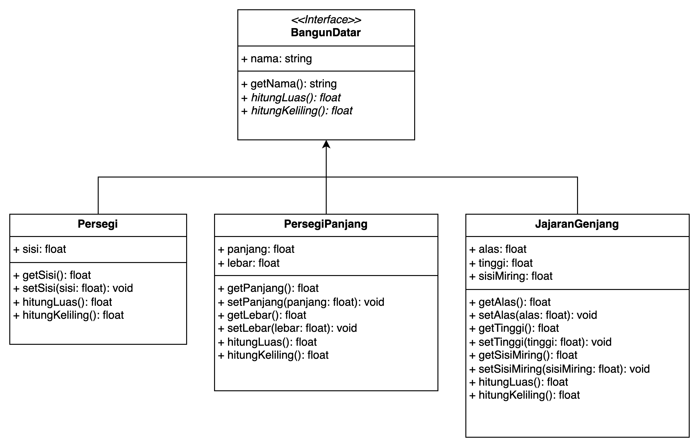

# IA.02 Tugas Praktek Programmer - Bagian 2

Program ini adalah implementasi dari Tugas Praktik Demonstrasi Bagian 2, yang meliputi pembuatan program berbasis OOP untuk menghitung luas dan keliling bangun datar.

## Deskripsi

Program Bagian 2 mengimplementasikan konsep OOP (Object-Oriented Programming) untuk membuat sistem perhitungan bangun datar dengan fitur:

1. Spesifikasi kelas bangun datar dalam UML
   
2. Implementasi kelas bangun datar dengan prinsip inheritance
3. Input dari pengguna untuk dimensi bangun datar
4. Perhitungan dan tampilan hasil luas dan keliling

## Persyaratan Sistem

- Python 3.6 atau lebih tinggi

## Instalasi

1. Pastikan Python sudah terpasang di sistem Anda:
   ```bash
   python --version
   ```

## Struktur Direktori

```
eserkom-bag2/
│
├── models/
│   ├── __init__.py
│   ├── bangun_datar.py    # Kelas abstrak dasar
│   ├── persegi.py         # Implementasi persegi
│   ├── persegi_panjang.py # Implementasi persegi panjang
│   └── jajaran_genjang.py # Implementasi jajaran genjang
│
├── tests/
│   └── test_bangun_datar.py  # Unit test
│
├── .env                    # Konfigurasi database
└── main.py         # Program utama
```

## Arsitektur OOP

Program ini mengimplementasikan prinsip OOP sebagai berikut:

1. **Encapsulation**: Atribut kelas bersifat private (`__nama`) dengan getter/setter
2. **Inheritance**: Semua kelas bangun datar mewarisi dari kelas abstrak `BangunDatar`
3. **Polymorphism**: Setiap kelas turunan mengimplementasikan metode abstrak dengan cara yang berbeda
4. **Abstraction**: `BangunDatar` adalah kelas abstrak yang mendefinisikan interface umum

## Diagram UML

Diagram UML menunjukkan:
- Kelas abstrak **BangunDatar** dengan metode abstrak `hitungLuas()` dan `hitungKeliling()`
- Tiga kelas turunan: **Persegi**, **PersegiPanjang**, dan **JajaranGenjang**
- Atribut dan metode yang sesuai untuk masing-masing kelas
- Relasi inheritance antar kelas

## Cara Menjalankan

Jalankan program dengan perintah:
```bash
python main.py
```

Program akan:
1. Menampilkan menu pilihan bangun datar
2. Meminta input dimensi sesuai pilihan bangun datar
3. Menghitung dan menampilkan luas dan keliling

## Detail Implementasi

### Kelas `BangunDatar` (Abstrak)
- Atribut: `_nama` (protected)
- Metode: `getNama()`, `hitungLuas()` (abstrak), `hitungKeliling()` (abstrak)

### Kelas `Persegi`
- Mewarisi dari `BangunDatar`
- Atribut: `__sisi` (private)
- Metode: `getSisi()`, `setSisi()`, `hitungLuas()`, `hitungKeliling()`
- Rumus Luas: sisi × sisi
- Rumus Keliling: 4 × sisi

### Kelas `PersegiPanjang`
- Mewarisi dari `BangunDatar`
- Atribut: `__panjang`, `__lebar` (private)
- Metode: `getPanjang()`, `setPanjang()`, `getLebar()`, `setLebar()`, `hitungLuas()`, `hitungKeliling()`
- Rumus Luas: panjang × lebar
- Rumus Keliling: 2 × (panjang + lebar)

### Kelas `JajaranGenjang`
- Mewarisi dari `BangunDatar`
- Atribut: `__alas`, `__tinggi`, `__sisiMiring` (private)
- Metode: `getAlas()`, `setAlas()`, `getTinggi()`, `setTinggi()`, `getSisiMiring()`, `setSisiMiring()`, `hitungLuas()`, `hitungKeliling()`
- Rumus Luas: alas × tinggi
- Rumus Keliling: 2 × (alas + sisiMiring)

## Unit Testing

Unit test dilakukan untuk memastikan kelas-kelas berfungsi dengan benar:
```bash
python -m unittest tests/test_bangun_datar.py
```

## Pengembangan Lebih Lanjut

Program ini dapat dikembangkan dengan:
1. Menambahkan jenis bangun datar lain (segitiga, trapesium, dll)
2. Membuat GUI untuk tampilan yang lebih baik
3. Menambahkan fitur visualisasi bangun datar